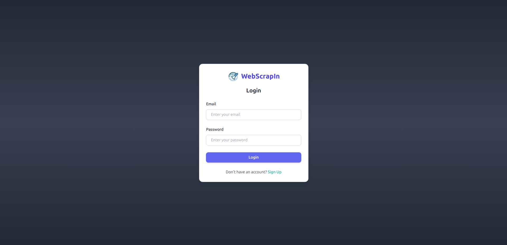
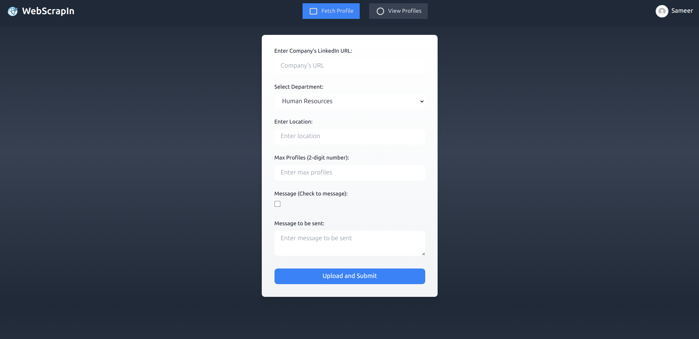
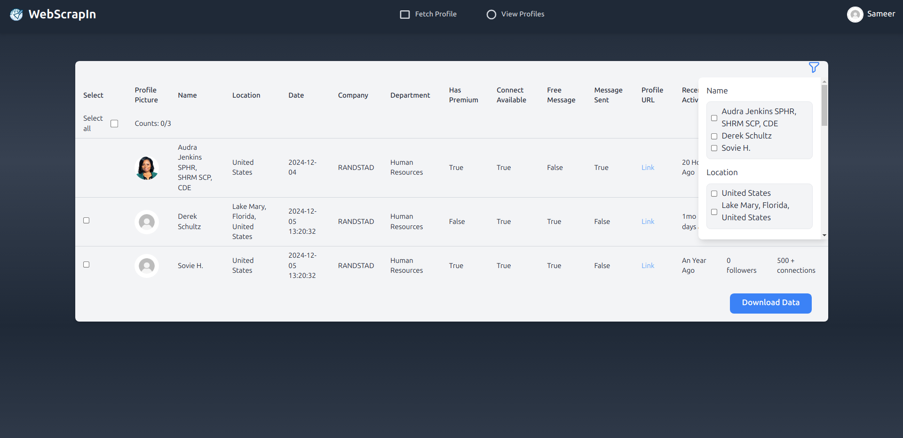
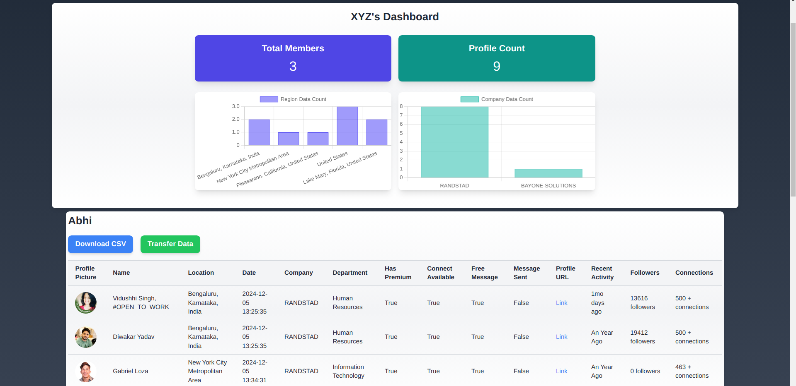

# WebScrapIn - LinkedIn Web Scraping & Automation

**WebScrapIn** is a web application designed for **LinkedIn profile scraping** and **automation**. It allows users to extract detailed information from LinkedIn profiles and company pages, including **location**, **department**, **industry**, and **recent activities**. The platform also supports **automated message sending**, **connection requests**, and **status tracking**, ensuring a more personalized and efficient approach to LinkedIn automation.

---

## Key Features

- **Profile Data Extraction**: Extract detailed profile information such as name, department, location, profile picture, and recent activity.
- **Filtering Options**: Filter profiles based on **location**, **department**, **industry**, and other attributes to target specific user groups.
- **Message Automation**: Automatically send personalized messages to LinkedIn users with random pauses to simulate human behavior.
- **Automated Connection Requests**: Automatically send connection invites 3 days after sending a message, ensuring non-intrusive interaction.
- **Status Tracking**: Track the status of each interaction in real time, including:
  - Whether the message has been sent.
  - Whether the connection request is pending or accepted.
  - Whether the user has a premium account.
- **Logging**: Detailed logs of extraction processes and user interactions, including errors, message statuses, and connection request statuses.

---

## Screenshots

### Login Page


### Home Page (Navigation 1)


### Home Page (Navigation 2)


### Admin Panel


---

## Server Setup on docker

### Prerequisites

Ensure that **Docker** is installed on your system. You can download Docker from [here](https://www.docker.com/get-started).

### Commands to Start the Server

1. **Build the Docker image**:
   ```bash
   docker-compose build

2. **Start Docker Container**:
   ```bash
   docker-compose up

3. **Stop Docker Container**:
   ```bash
   docker-compose down


## Server Setup on windows

### Prerequisites

Ensure that **WSL** is installed on your system. You can download WSL from [here](https://learn.microsoft.com/en-us/windows/wsl/install). (Skip this step if docker is already installed)

### Commands to Start the Server

1. **Install distro**
   ```bash
   wsl --install -d Ubuntu-24.04

2. **Open terminal in project dir, run**:
   ```bash
   wsl -d Ubuntu-24.04

3. **Install packages**:
   ```bash
   sudo apt-get update -y && \
   sudo apt-get upgrade -y && \ 
   sudo apt-get install python3-pip dos2unix redis-server wget -y && \
   wget -q https://dl.google.com/linux/direct/google-chrome-stable_current_amd64.deb && \
   sudo apt-get update && \
   sudo apt-get install -y --no-install-recommends ./google-chrome-stable_current_amd64.deb && \
   rm -f *.deb && \
   pip install -r requirements.txt --break-system-packages 

4. **Make executable file**:
   ```bash
   chmod +x start.sh && dos2unix start.sh

5. **Start Server**:
   ```bash
   ./start.sh

# Changelog

## v0.11 (Latest)
- Scheduled connection invites 3 days after sending a message (default = 100 days).
- Disabled UI checkboxes for profiles with messages already sent.
- Utilized cookies obtained from a Chrome extension for login.
- Enhanced UI and fixed login issues.
- Supported multiple requests and Chrome driver instances.
- Added functionality to track whether messages were sent or invites are pending.
- Improved session handling to last 10 minutes.
- Enabled auto connection invites.
- Persisted data in `/webscrapin_data` directory for better storage.
- Added progress messages and assigned 2 server workers (scalable).
- Used Pandas and SQL for better insights into scraped data.

## v0.06 - v0.10 (Major Updates and Fixes)
- Optimized code and updated selectors for accuracy.
- Integrated `selenium_stealth` for reduced sleep times and better handling.
- Supported headless mode and integrated `undetected_chromedriver`.
- Added send-message functionality with random pauses and optional message input.
- Logged errors separately and improved UI to display collected data.
- Automatically sent batch messages and stored data in SQLite DB.
- Updated "Connect" functionality to work with notes and dynamic selectors.
- Migrated data to a temporary `libsql` database (to be hosted online later).
- Fixed Docker compatibility issues and switched to Quart for async support.
- Enhanced admin panel with region and company-wise data counts.

## v0.02 - v0.05 (Ongoing Updates)
- Tracked profiles with and without "Connect" or "Message" options.
- Saved profile URLs and names into CSVs.
- Created logs for user and company profiles.
- Integrated free message checks and premium user detection.
- Fixed profile selection freeze and enhanced data collection performance.
- Built basic Selenium UI for inputting department/region from CSV files.
- Allowed company URLs as input via CSV files.
- Stored scraped data in Excel files with multi-sheet support.
- Reinitialized sessions on file upload and handled temporary file storage.
- Dynamically retrieved selectors for followers and connections.

## v0.01 (Initial Release)
- Redirected to company’s "People" tab.
- Displayed attributes like location and qualifications.
- Enabled location and department-based filtering.
- Retrieved user name and checked premium status.
- Collected recent activity data.
- No more storing cookies for security purpose.
---

# Features

**WebScrapIn** provides the following key features:

- **Profile Data Extraction**: Extract LinkedIn member details, including name, department, location, profile picture, and recent activity.
- **Connection Interaction**: Automatically send connection requests after messages, with or without notes, to ensure efficient interactions.
- **Message Automation**: Automatically send personalized messages to LinkedIn users with random pauses to simulate human behavior.
- **Batch Processing**: Supports CSV input for bulk scraping, allowing users to process large amounts of data at once.
- **Status Tracking**: Track the real-time status of messages and connection requests, including whether the message was sent, the connection request is pending, or if the user is a premium member.
- **Logging & Storage**: Maintains detailed logs of scraping processes, including errors, message statuses, and connection request statuses. Stores data in CSV/Excel files and logs.
- **UI Enhancements**: Displays collected data through an easy-to-use interface, with dynamic inputs and error logs to ensure smooth operation.


# Roadmap

**WebScrapIn** is actively being developed, with several new features and improvements planned. Here's what you can expect in the future:

### Upcoming Features
- **Fix**: Progress status for multi-threading — improve handling of status updates when running in parallel.
- **Improve**: Performance of the web app — optimize the app to handle larger volumes of data and increase response times.

### Planned Improvements
- **Enhanced UI**: Further improvements to the user interface, including more intuitive navigation and display of collected data.
- **Expanded Filters**: More filtering options to allow users to scrape LinkedIn data more precisely, such as additional fields for industry, company size, etc.
- **Advanced Message Automation**: More advanced algorithms for personalizing message delivery to increase engagement.
- **Integration with Other Platforms**: Future integration with other social platforms for broader scraping and automation capabilities.

---

